# VectorBox

> Personalized film recommendation engine powered by semantic embeddings and hybrid signal fusion.



<sub>Six containers behind one `docker compose up`. FastAPI also hosts the APScheduler jobs and the sentence-transformers encoder in-process — there is nothing extra to deploy for either. Interactive version, with per-node detail: `docs/architecture/vectorbox-architecture.html` — clone and open it, GitHub serves HTML as source rather than rendering it.</sub>

## What It Does

VectorBox ingests your film history — via Letterboxd export, RSS feed, or an onboarding carousel — and builds a personal taste model using vector embeddings, director/actor affinity graphs, and collaborative filtering. The result is a multi-section recommendation feed that surfaces films you'd actually want to watch, not just what's trending.

It's built for people who care about *what* they watch next, not just that something is on.

> **Note:** v3.1.0 is in preparation on `feature/operational-debt` — source-side filtering, the
> Leaving Soon row, the watchlist filter and the mood axes. The last tagged release is v3.0.0
> (the brutalist "ACID" UI), merged to `master`. CI/CD has a dedicated sprint planned; the Playwright e2e harness predates the Clerk migration and will be rewritten there.

## How It Works — The Trident Engine

The "Picked For You" core is a three-signal hybrid. Each signal captures a different dimension of taste, and they're fused through Reciprocal Rank Fusion (RRF) before a final diversity pass. (Other feed rows — Because You Watched, Niche Picks, Hidden Gems — are separate builders described under Feed Sections.)

### Signal A — Vibe (Semantic Similarity)
Ranks the whole catalogue against your taste centroid in vector space. Embeddings are generated from LLM-enriched cinematic descriptions — not just plot summaries, but tone, pacing, and visual style — using Groq-hosted open models (`services/llm_models.py` holds the chains and is the only place a model ID is written down), then encoded with `google/embeddinggemma-300m` (768 dimensions; gated HuggingFace model — requires `HF_TOKEN`). Descriptions are strictly name-free (no titles, directors, or franchises) so the vector space encodes *theme*, not identity. An anti-vector built from your low-rated and rejected films demotes the decile of each row's head that sits closest to it. Honest caveat: measured against a proper control — future dislikes vs future *likes*, disjoint folds — that demotion is currently **indistinguishable from chance** (AUC 0.527 [0.475, 0.579] on the one user with enough dated history). It stays because the measurement has one user behind it, not because it is proven; see `docs/HALLAZGOS_2026-08-19.md`.

### Signal B — Auteur (Director & Cast Affinity)
Mines your rating history for directors and actors you consistently rate highly (Bayesian-shrunk so two lucky films don't crown a favorite) and surfaces their filmographies you haven't seen.

### Signal C — Crowd (Collaborative Gems)
Pulls "users also loved" candidates from TMDB `/movie/{id}/recommendations` for up to 8 high-quality films in your history. Gated by genre overlap with the seed and a VectorBox Score floor (`MIN_SIGNAL_C_SCORE = 62`), which drops 46-65% of the pool. Deliberately *not* gated by vector similarity: these candidates sit at cosine ~0.66, below the real-neighbour population, because they are a behavioural signal rather than a thematic one — and that is exactly their value (~95% of them never appear in Signal A). Down-weighted in fusion (`SIGNAL_C_RRF_WEIGHT = 0.7`) so crowd-only films season the row rather than flood it.

### Fusion & Post-Processing
All signals merge through RRF, then pass through a sigmoid quality weighting on VectorBox Score (0–100), director diversity caps (max 2 per director), and MMR reranking for vector-space diversity.

## Tech Stack

### Backend
- **FastAPI** + Python 3.11 — async throughout
- **PostgreSQL 15** + SQLAlchemy 2.0 (async) — film catalog, ratings, clusters
- **Qdrant** — vector database for semantic similarity search
- **Redis 7** — section-level feed caching with per-TTL freshness controls
- **Groq** — cinematic description generation and Magic Box intent parsing (chains in `services/llm_models.py`: enrichment qwen3.8-27b → gpt-oss-120b → gpt-oss-20b, parsing gpt-oss-120b → qwen3.8-27b). The free-tier lineup churns — that file is the single source of truth, and the live list is `GET /v1/models`, never a blog
- **google/embeddinggemma-300m** — sentence embeddings (768 dimensions; requires `HF_TOKEN` for the gated model)
- **Clerk** — authentication (JWKS-based JWT verification)

### Frontend
- **Next.js 16** (App Router) + React 19
- **Tailwind CSS v4**
- **Framer Motion** — animations and transitions
- **TypeScript** — strict typing throughout

### Infrastructure
- **Docker Compose** — local development (Postgres, Qdrant, Redis, backend, frontend)
- **Alembic** — database migrations
- **OpenTelemetry + Jaeger** — distributed tracing

## Key Features

- **Letterboxd ZIP import** — full watch history, ratings, watchlist, diary, and liked films
- **RSS sync** — automatic incremental updates from your Letterboxd diary feed (early-exit page scan, daily reconcile)
- **Onboarding carousel** — cold-start onboarding without a Letterboxd account (4-signal scale: not for me / ok / liked / loved)
- **Guest mode** — explore recommendations before creating an account
- **Magic Box** — natural language film search (LLM intent parse → editable chips) plus a literal "find a film" title mode
- **Filtered feed** — the console filters (year / runtime / quality / genres / providers) return the full sectioned feed, order-preserving, not a flat result list
- **More Like This** — find similar films using up to 5 seed movies
- **Group recommendations** — find films for multiple users with merged taste profiles (Letterboxd guests welcome), plus shareable group/pair match cards
- **Why this film** — per-recommendation breakdown (trident weights, anchors, embedding neighbours, cluster)
- **Vector space map** — an explorable 2-D projection of your taste clusters
- **Taste card** — shareable PNG profile card (story + square formats)
- **Upcoming movies** — personalized upcoming releases filtered by your genre preferences
- **Mood filter** — five quadrants over two measured axes of the vector space (gravity × humanity); it filters the feed rather than scoring it, so it steers what you feel like tonight without overriding your history
- **Content preferences** — tag-based content filtering (avoid jumpscares, gore, slow pacing, etc.)
- **Auteur & Cast signals** — dedicated feed rows for your favorite directors and recurring actors
- **Web-watches CSV export** — films marked watched in-app export back to Letterboxd-importable CSV

## Feed Sections

| Section | Description |
|---|---|
| Because You Watched | Semantic neighbours of a scored anchor from your history |
| Picked For You | Trident RRF fusion of vibe, auteur, and crowd signals |
| Niche Picks | One of 9 rotating global themes with curated filters |
| Hidden Gems | High-quality discoveries with low popularity |
| From Your Favorite Directors | Director-driven recommendations |
| Cast Picks | Actor-driven recommendations |
| Popular on Letterboxd | Scraped trending list with real ★ ratings, filtered against your history |
| Available Now | Unwatched watchlist items on your streaming providers |
| On Your Radar | Personalized upcoming releases (country-aware release badges) |
| Leaving Soon | Films about to leave a streaming service (urgent first, then by quality) |
| Outside Your Comfort Zone | Films from genres you don't usually watch |
| Random Picks | Serendipity row |

When console filters are active, the same sections rebuild **filter-aware**: year / runtime / genre / quality apply as output filters (the live ranking with non-matches removed — never re-ranked), while providers, mood and the watchlist filter **at source** — inside each row's own query or vector search — because they are selective enough that post-filtering would starve the rows. Rows without enough matches hide.

The SOURCE toggle switches the whole feed between the catalogue and your unwatched watchlist, so every row above is also available as "…from my list" — and it composes with mood and providers.

## Architecture

The recommendation pipeline uses two ID spaces that must not be confused:
- **`Movie.id`** (internal PK) — used for PostgreSQL joins, `UserRating.movie_id`, watched-set deduplication
- **`Movie.tmdb_id`** (TMDB API ID) — used for Qdrant vector indexing, feed-level `seen_ids` deduplication

Feed orchestration runs 12 section-generation tasks in parallel via `asyncio.gather()`, each with its own isolated database session. An anti-vector is pre-computed once before parallelization and shared across signals that need it.

### Request path — one feed signal

Every signal goes through the same cache-then-lock path (`_get_signal_with_cache_and_lock`,
`services/recommendation_service.py`). The lock is what stops N concurrent misses from all
recomputing the same signal.


<sub>Explorable version: `docs/diagrams/signal-cache-lock.html` — clone and open it, GitHub serves HTML as source rather than rendering it.</sub>

The lock carries a per-worker token and is released through a Lua compare-and-delete, so a
worker whose compute outran the 30s TTL cannot delete a different worker's fresh lock.

### Ingest path — write order

A single film is written to two stores that share no transaction. The Qdrant point is keyed by
`tmdb_id`, so `MovieService.ingest_movie` writes it **before** the Postgres commit: a vector failure
then aborts the whole ingest, whereas the reverse order would persist a film that is invisible to
search and raises no error. The four failure branches and what each one leaves behind:


<sub>Explorable version: `docs/diagrams/ingest-write-order.html` — clone and open it, GitHub serves HTML as source rather than rendering it.</sub>

## Getting Started

### Prerequisites

- Docker Desktop with Compose v2
- [TMDB API key](https://www.themoviedb.org/settings/api) + [OMDb API key](https://www.omdbapi.com/apikey.aspx)
- [Groq API key](https://console.groq.com/) (for cinematic descriptions)
- [HuggingFace token](https://huggingface.co/settings/tokens) with access granted to `google/embeddinggemma-300m` (gated model; required at first launch to download the embedding model)
- [Clerk account](https://clerk.com/) (for authentication)
- A Letterboxd account (optional — can use the onboarding carousel instead)

### Setup

```bash
git clone https://github.com/braisbrg/vectorbox.git
cd vectorbox
cp .env.example .env
# Fill in your API keys in .env
```

### Launch

**Windows (PowerShell):**
```powershell
./setup.ps1
```

**Linux / macOS:**
```bash
chmod +x setup.sh && ./setup.sh
```

Add `-clean` / `--clean` for a fresh volume wipe.

### Access

| Service | URL |
|---|---|
| Frontend | http://localhost:3000 |
| API Docs | http://localhost:8000/docs |
| Jaeger (tracing) | http://localhost:16686 |
| Qdrant Dashboard | http://localhost:6333/dashboard |

### First Run

Create an account, then either import your Letterboxd export ZIP (Settings → Import & Export → Export Data) or use the onboarding carousel to rate 15+ films. The feed needs about 30 rated films before all signals become useful; under that threshold, the engine uses more permissive pools so the feed isn't empty.

## Scripts

See [SCRIPTS_GUIDE.md](./docs/SCRIPTS_GUIDE.md) for the full catalogue of maintenance, backup, and data scripts.

## Development

- **Branch strategy:** `develop` for active work, `feature/*` for significant changes, `master` for tagged releases only.
- **Commit format:** `feat:`, `fix:`, `refactor:`, `perf:`, `docs:`
- **Package manager:** pnpm (frontend), pip with hash-verified lockfile (backend)
- **Backend commands** run inside Docker: `docker compose exec backend ...`

### Two traps that will cost you an afternoon

**Your edit is probably not running.** Uvicorn auto-reload does not fire on
host-side edits under Windows — bind-mount file events never reach the container
watcher. The frontend container serves a production build, so it does not
hot-reload at all.

```bash
docker compose restart backend            # after ANY backend change
docker compose up -d --build frontend     # after ANY frontend change
```

A change that type-checks is not a change that ran. If feed logic changed, also
flush the `section:*` Redis keys: the cache-save block refreshes TTLs on
cache-hit sections, so stale content self-perpetuates.

**Groq's free tier caps at 8000 tokens per MINUTE**, not per day, and one Magic
Box parse costs ~2000. Four searches in quick succession exhaust it, after which
the parser returns nothing and every answer degrades. Any burst test needs pacing
or it measures the rate limiter instead of the engine.

### Tests

```bash
docker compose exec backend python -m pytest -q                    # hermetic
docker compose exec backend python scripts/verify_search_branches.py --repeat 3
```

The default suite touches no external service; the few that do are marked
`integration` and deselected. `verify_search_branches.py` pins search behaviour
using `forced_intent`, which bypasses the LLM entirely — so it is deterministic,
repeatable, and free. Prefer it to anything that measures *through* the parser.

Three tests are contract guards, each closing a class of bug that fails in
silence — something declared that never gets applied:

| test | what it refuses to let happen |
|---|---|
| `test_qdrant_filter_contract` | a filter key written but never handled, so the search silently runs without it |
| `test_qdrant_payload_writers` | a payload writer that omits a key, which DELETES it from the point |
| `test_no_dead_parameters` | a parameter accepted and never read, so every caller passing it is ignored |

## License

[MIT](./LICENSE)
